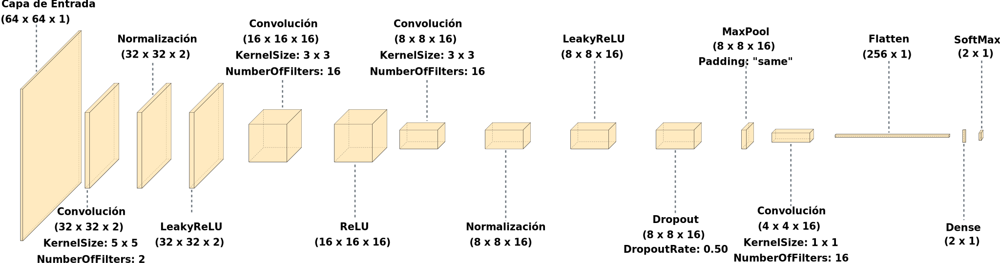

# Hybrid-Evolutionary Multi-Objective Method for Automatic Design of Lightweight CNN Architecture applied to Coronary Stenosis Classification

This repository contains the Matlab code *ready to run* of
a Lightweight Convolutional Neural Network (CNN) focused in the 
classification of positive and negative coronary stenosis cases.

The CNN model is as follows:

*Image with copyright @MDPI-Algorithms*


### If you use this code, please reference us as following:
#### BibTEx
```
@Article {Gil2026
    title = {Hybrid-Evolutionary Multi-Objective Method for Automatic Design of Lightweight CNN Architecture applied to Coronary Stenosis Classification},
    author = {Gil-Rios, Miguel-Angel and Cruz-Aceves, Ivan and Hernandez-Aguirre, Arturo and G.-de-Paz, Erick and Lopez-Hernandez, Juan},
    journal = {Algorithms},
    volume = {Pending...},
    year = {2026},
    number = {Pending...},
    article-number = {Pending...},
    url = {Pending...},
    issn = {Pending...},
    doi={Pending...}
}
```


